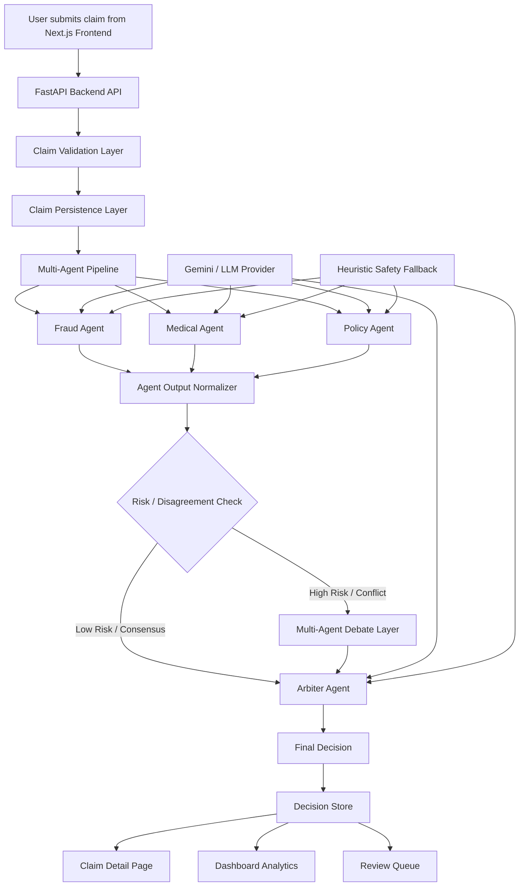
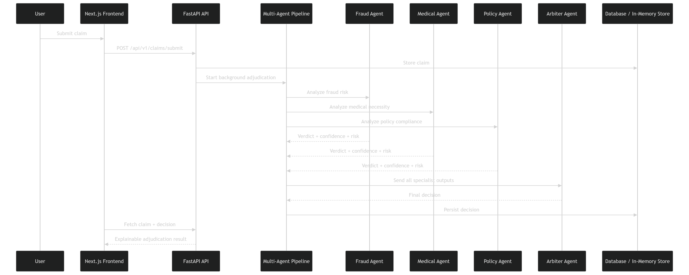
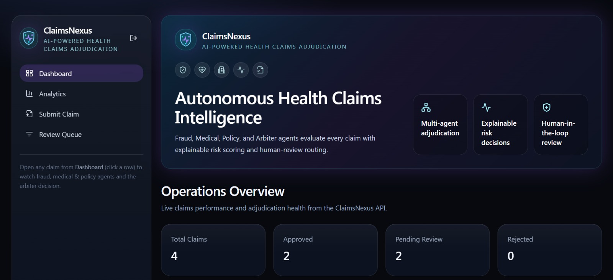
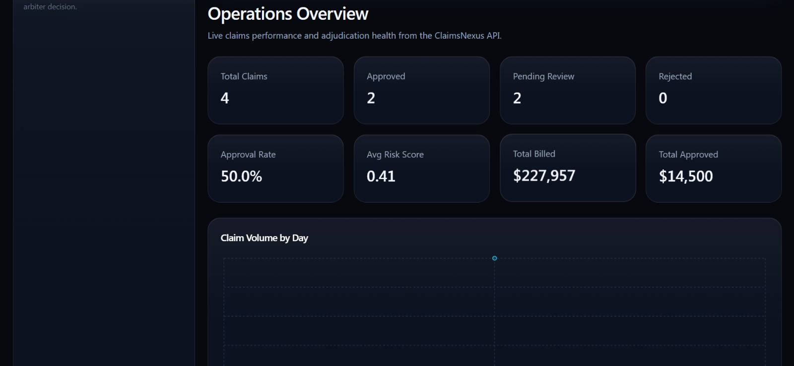
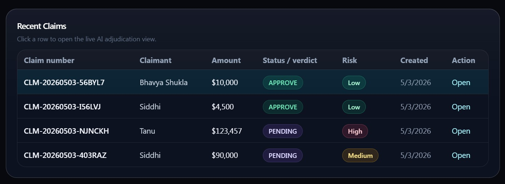
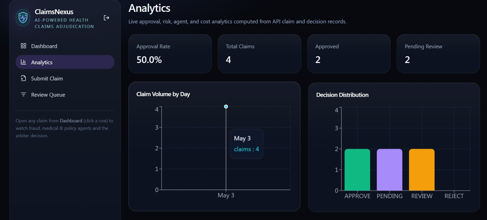
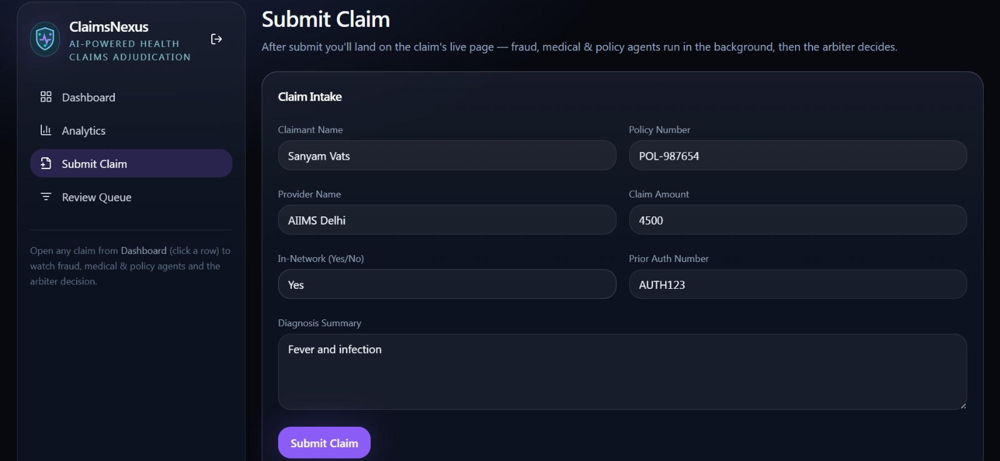
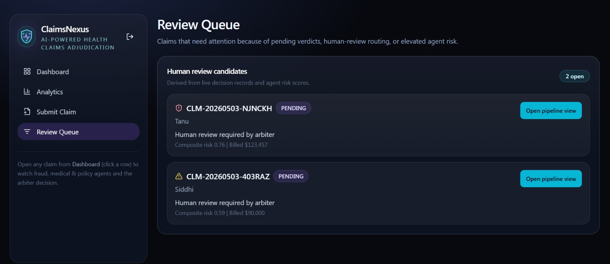

# ClaimsNexus — Autonomous Multi-Agent Health Claims Adjudication

ClaimsNexus is an AI-powered healthcare insurance claims adjudication platform that uses specialized agents to evaluate claims across fraud risk, medical necessity, policy compliance, and final arbitration.

It is designed to make claim processing faster, more explainable, and safer by combining multi-agent reasoning, risk scoring, human-in-the-loop review, real-time dashboards, and audit-ready decision traces.

---

## 🚀 Project Summary

Healthcare insurance claims processing is often slow, manual, and difficult to audit. A single claim may require fraud checks, medical necessity validation, policy compliance verification, prior authorization checks, provider-network validation, and final approval or review routing.

ClaimsNexus solves this problem using a multi-agent AI workflow:

- **Fraud Agent** detects suspicious billing and anomaly signals.
- **Medical Agent** validates clinical necessity and diagnosis-procedure alignment.
- **Policy Agent** checks plan compliance, network status, and prior authorization.
- **Arbiter Agent** combines all agent outputs into a final explainable decision.

The system does not blindly auto-approve or auto-deny claims. Risky claims are routed to human review, while clean claims can be fast-tracked.

---

## ✨ Key Features

- Multi-agent AI decision pipeline
- Fraud, Medical, Policy, and Arbiter agents
- Gemini-powered LLM reasoning with safe fallback handling
- Deterministic heuristic fallback when LLM is unavailable
- Real-time claim submission and adjudication flow
- Explainable agent verdicts, confidence scores, and risk scores
- Multi-agent debate / disagreement handling
- Human-review queue for risky claims
- Real dashboard metrics from backend data
- Analytics charts based on live claim and decision data
- FastAPI backend with Swagger/OpenAPI documentation
- Next.js + Tailwind frontend
- SQLite fallback for stable local/demo execution

---

## 🧠 Problem Statement

Insurance claim adjudication involves multiple complex checks:

1. Is the claim fraudulent or suspicious?
2. Is the treatment medically necessary?
3. Does the claim follow policy rules?
4. Is the provider in-network?
5. Is prior authorization available?
6. Should the claim be approved, rejected, or sent to human review?

Traditional workflows are often slow, manual, and hard to explain. ClaimsNexus introduces an autonomous multi-agent layer that supports faster and more transparent claim decisions.

---

## 🏗️ System Architecture

---

## 🏗️ Architecture Diagram

The following diagram shows how ClaimsNexus processes a healthcare claim from submission to final adjudication.

---

## 🖥️ Project Screenshots

### Dashboard / Operations Cockpit

### Operation Overview

### Recent Claim Section

### Analytics 

### Claim Submission Form

### Human Review Queue / Case Monitoring

---

##Video Explanation OF Claimsnexus

https://drive.google.com/file/d/1wsxwCO4FuMJL3RvzZDEJBTC2OdrEaT2q/view?usp=sharing
